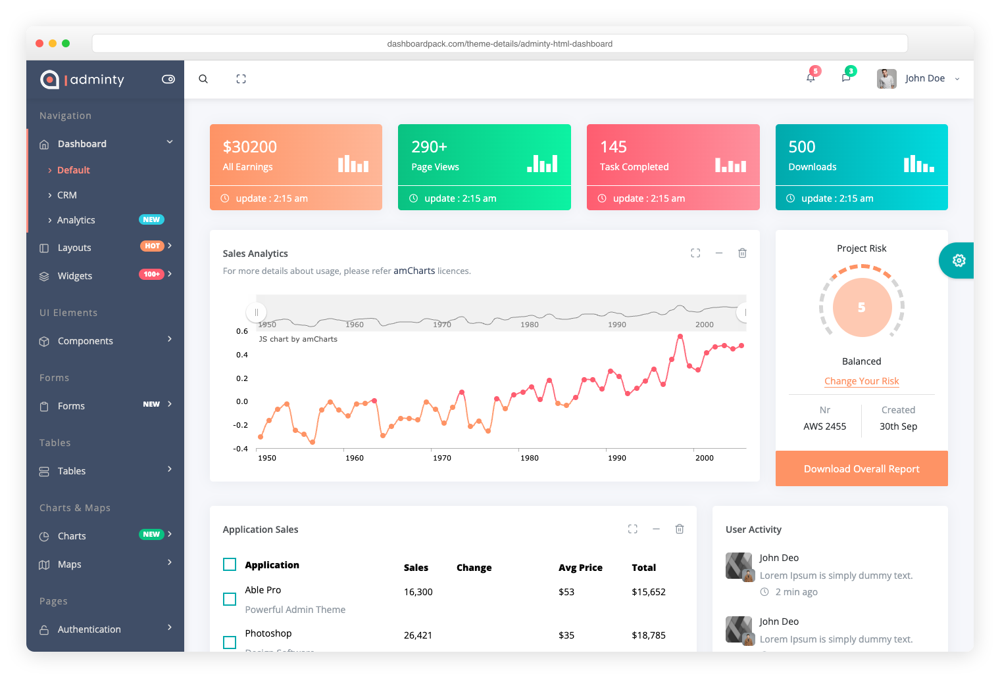

# Adminator — 2026 Admin Dashboard Template (v4.0.0)

**Adminator 4.0** is a vanilla-JS admin dashboard template with a token-driven CSS-variable design system, dark mode, and zero framework dependencies. **No jQuery. No Bootstrap.** Just clean HTML, modern CSS, and ~700 KB of production JS for the entire 18-page template.

> **Heads up — v4.0.0 is a ground-up rewrite.** New design system, new shell architecture, Bootstrap removed. If you prefer the previous design, the v3 codebase lives on the [`legacy-v3`](https://github.com/puikinsh/Adminator-admin-dashboard/tree/legacy-v3) branch and will continue to receive security updates.

**[adminator.colorlib.com →](https://adminator.colorlib.com/)** · **[Live Demo →](https://preview.colorlib.com/theme/adminator/index.html)** · **[Documentation →](https://adminator.colorlib.com/docs/)** · **[Looking for premium templates? Visit DashboardPack →](https://dashboardpack.com/)**

## Preview

### Light mode


### Dark mode


### A few of the 18 pages

<table>
  <tr>
    <td align="center" width="33%"><br><strong>Email</strong> — 3-pane inbox</td>
    <td align="center" width="33%"><br><strong>Calendar</strong> — full FullCalendar</td>
    <td align="center" width="33%"><br><strong>Charts</strong> — themed Chart.js</td>
  </tr>
  <tr>
    <td align="center"><br><strong>Forms</strong> — inputs, switches</td>
    <td align="center"><br><strong>Data Table</strong> — sort, filter, paginate</td>
    <td align="center"><br><strong>Sign In</strong> — split-screen auth</td>
  </tr>
</table>

## Upgrade to a Premium Dashboard

Need advanced features, dedicated support, and production-ready code? Explore our handpicked collection of professional admin templates on [DashboardPack](https://dashboardpack.com/?utm_source=github&utm_medium=readme&utm_campaign=adminator).

<table>
  <tr>
    <td align="center" width="50%">
      <a href="https://dashboardpack.com/theme-details/tailpanel/?utm_source=github&utm_medium=readme&utm_campaign=adminator">
        
      </a>
      <br>
      <a href="https://dashboardpack.com/theme-details/tailpanel/?utm_source=github&utm_medium=readme&utm_campaign=adminator"><strong>TailPanel</strong></a>
      <br>
      <sub>React + TypeScript + Tailwind CSS + Vite. 9 dashboard designs, dark and light themes.</sub>
    </td>
    <td align="center" width="50%">
      <a href="https://dashboardpack.com/theme-details/admindek-html/?utm_source=github&utm_medium=readme&utm_campaign=adminator">
        
      </a>
      <br>
      <a href="https://dashboardpack.com/theme-details/admindek-html/?utm_source=github&utm_medium=readme&utm_campaign=adminator"><strong>Admindek</strong></a>
      <br>
      <sub>Bootstrap 5 + vanilla JS. 100+ components, dark/light modes, RTL support, 10 color presets.</sub>
    </td>
  </tr>
  <tr>
    <td align="center" width="50%">
      <a href="https://dashboardpack.com/theme-details/adminty-html-dashboard/?utm_source=github&utm_medium=readme&utm_campaign=adminator">
        
      </a>
      <br>
      <a href="https://dashboardpack.com/theme-details/adminty-html-dashboard/?utm_source=github&utm_medium=readme&utm_campaign=adminator"><strong>Adminty</strong></a>
      <br>
      <sub>Bootstrap 5. 160+ ready-made pages, full UI component library for rapid development.</sub>
    </td>
    <td align="center" width="50%">
      <a href="https://dashboardpack.com/theme-details/architectui-dashboard-html-pro/?utm_source=github&utm_medium=readme&utm_campaign=adminator">
        
      </a>
      <br>
      <a href="https://dashboardpack.com/theme-details/architectui-dashboard-html-pro/?utm_source=github&utm_medium=readme&utm_campaign=adminator"><strong>ArchitectUI</strong></a>
      <br>
      <sub>Bootstrap 5. 250+ components, modular architecture, 9 unique dashboard layouts.</sub>
    </td>
  </tr>
  <tr>
    <td align="center" width="50%">
      <a href="https://dashboardpack.com/theme-details/kero-jquery-html-dashboard-pro/?utm_source=github&utm_medium=readme&utm_campaign=adminator">
        
      </a>
      <br>
      <a href="https://dashboardpack.com/theme-details/kero-jquery-html-dashboard-pro/?utm_source=github&utm_medium=readme&utm_campaign=adminator"><strong>Kero</strong></a>
      <br>
      <sub>Bootstrap 5 + Webpack. Dual layout system (horizontal + sidebar), SASS theming.</sub>
    </td>
    <td align="center" width="50%">
      <a href="https://dashboardpack.com/theme-details/cryptocurrency-dashboard/?utm_source=github&utm_medium=readme&utm_campaign=adminator">
        
      </a>
      <br>
      <a href="https://dashboardpack.com/theme-details/cryptocurrency-dashboard/?utm_source=github&utm_medium=readme&utm_campaign=adminator"><strong>Cryptocurrency Dashboard</strong></a>
      <br>
      <sub>Bootstrap. Built specifically for ICO platforms, Bitcoin tracking, and crypto portfolios.</sub>
    </td>
  </tr>
</table>

<p align="center">
  <a href="https://dashboardpack.com/?utm_source=github&utm_medium=readme&utm_campaign=adminator"><strong>View All Premium Templates</strong></a>
</p>

## Table of Contents

- [What's New in v4.0.0](#whats-new-in-v400)
- [Quick Start](#quick-start)
- [Pages Included](#pages-included)
- [Architecture](#architecture)
- [Theming](#theming)
- [Tech Stack](#tech-stack)
- [Migrating from v3](#migrating-from-v3)
- [Staying on v3](#staying-on-v3)
- [Browser Support](#browser-support)
- [Changelog](#changelog)
- [Authors](#authors)
- [License](#license)

## What's New in v4.0.0

A ground-up redesign and rewrite. The whole template is built around a single CSS-variable token system, with a JS shell that renders the sidebar, topbar, and footer once for all 18 pages. **Bootstrap is gone.** Production JS dropped from ~4.5 MB to ~700 KB — an **85% reduction**.

### Highlights

- **Token-driven design system.** All colors, typography, spacing, and shadows live in `_tokens.scss` as CSS variables with light + dark variants. Edit one variable, every component updates.
- **Real dark mode.** A single `data-theme` attribute on `<html>` swaps the entire UI — including Chart.js, FullCalendar, and jsvectormap, which all re-render via a `MutationObserver` to read the new token values.
- **Zero framework CSS.** No Bootstrap. No utility-class soup. Every UI primitive (buttons, dropdowns, alerts, badges, modals, tabs, accordions, switches, progress bars) is custom-built and theme-aware.
- **Single JS shell.** Sidebar/topbar/footer render from a single `NAV` manifest in `Shell.js`. Pages declare `<body data-active="..." data-crumbs="...">` and three placeholders. Add a nav item by editing one array.
- **Real, themed library integrations.** Chart.js (6 chart types), FullCalendar (all four views, 24 seed events), jsvectormap (world map with 10 markers). All read CSS variables and re-render on theme toggle.
- **All 18 pages redesigned**: Dashboard, Email, Calendar, Chat, Compose, Charts, Forms, UI Elements, Buttons, Basic Table, Data Table, Google Maps, Vector Maps, Blank, Sign In, Sign Up, 404, 500.

### Bundle size

| Metric                     | v3.0.0           | v4.0.0           | Δ        |
| -------------------------- | ---------------- | ---------------- | -------- |
| Production JS (total)      | ~4.5 MB          | ~700 KB          | **−85%** |
| Production CSS             | ~280 KB          | 90 KB            | **−68%** |
| Top-level npm dependencies | 16               | 8                | **−50%** |

See [CHANGELOG.md](CHANGELOG.md#400---2026-04-27) for the full release notes, including the migration guide.

## Quick Start

### Prerequisites

- **Node.js** 18.12 or higher
- **npm** 9 or higher (ships with Node.js)

### Install and run

```bash
# Clone the repo
git clone https://github.com/puikinsh/Adminator-admin-dashboard.git adminator
cd adminator

# Install dependencies
npm install

# Start the dev server (http://localhost:4000)
npm start
```

### Build commands

```bash
# Development server with HMR
npm start

# Production build (extracted CSS, minified)
npm run release:minified

# Default build (extracted CSS, unminified — useful for debugging)
npm run build

# Lint everything (JS + SCSS) — must be 0/0 to ship
npm run lint

# Bundle size analyzer
npm run build:analyze

# Wipe dist/
npm run clean
```

### Install via npm

The current v4 line is published as [`adminator-admin-dashboard`](https://www.npmjs.com/package/adminator-admin-dashboard) on npm:

```bash
npm install adminator-admin-dashboard
```

The package ships both `src/` and a pre-built `dist/`. Use it directly:

```js
// In your bundler / app
import 'adminator-admin-dashboard/dist/style.css';
// dist/index.html + 17 other prebuilt pages are also in node_modules
```

Or copy the prebuilt files out of `node_modules/adminator-admin-dashboard/dist/` and serve them statically.

> **⚠️ Don't pin to `@^2` or `@^3`.** Older majors on npm (2.7.x – 2.9.0) point to legacy code from before the 2026 redesign — they predate the token-driven design system, dark mode, and the new shell architecture. The latest `4.x` is what corresponds to this repository.

## Pages Included

All 18 pages share the same shell (sidebar + topbar + footer) and theme system. Standalone pages (auth, errors) skip the shell.

| Page              | Description                                                          |
| ----------------- | -------------------------------------------------------------------- |
| Dashboard         | KPIs, real Chart.js monthly chart, regional stats, todo, weather     |
| Email             | 3-pane inbox with folders, message list, reader pane, attachments    |
| Calendar          | Real FullCalendar (Day/Week/Month/Agenda) with seed events           |
| Chat              | 2-pane conversation list + thread with typing indicator              |
| Compose           | Rich-text email composer with attachments and scheduling             |
| Charts            | 6 themed Chart.js examples (line, bar, doughnut, radar, area, stack) |
| Forms             | Inputs, selects, switches, checkboxes, validation states             |
| UI Elements       | Alerts, badges, progress, spinners, tabs, accordion, modal, tooltips |
| Buttons           | Solid/soft/outline/ghost variants, sizes, icons, button groups       |
| Basic Table       | Striped table with status tags and trend indicators                  |
| Data Table        | Sortable + paginated table with filters, search, row selection       |
| Google Maps       | Embedded Google Map with offices table                               |
| Vector Maps       | Real jsvectormap with city markers and continent KPIs                |
| Blank             | Starter page with hero + empty card                                  |
| Sign In / Sign Up | Split-screen auth with social buttons                                |
| 404 / 500         | Themed error pages with gradient codes                               |

## Architecture

The full architecture is documented in [CLAUDE.md](CLAUDE.md). The short version:

```text
src/
├── *.html                       # 18 pages, ~500 lines each
└── assets/
    ├── scripts/2026/            # The only JS — 6 modules
    │   ├── index.js             # entry: imports SCSS, mounts shell, runs init
    │   ├── Shell.js             # NAV manifest + sidebar/topbar/footer renderers
    │   ├── init.js              # theme toggle, dropdowns, accordions, tabs, etc.
    │   ├── charts.js            # Chart.js seeds, theme-aware
    │   ├── calendar.js          # FullCalendar, theme-aware
    │   └── maps.js              # jsvectormap, theme-aware
    └── styles/2026/             # The only SCSS — 18 partials
        ├── index.scss           # entry, @use's everything below
        ├── _tokens.scss         # CSS variables (light + dark)
        ├── _shell.scss          # sidebar, topbar, footer chrome
        ├── _components.scss     # buttons, cards, hero, table, tag
        ├── _ui.scss             # alerts, badges, progress, tabs, modal
        ├── _forms.scss          # inputs, select, switch, check, radio
        ├── _auth.scss / _error.scss / _chat.scss / _data.scss / _charts.scss
        ├── _dashboard.scss / _email.scss / _calendar.scss
        ├── _fullcalendar.scss   # FullCalendar token overrides
        └── _responsive.scss     # all media queries in one place
```

Every shell page follows the same anatomy:

```html
<body data-active="dashboard" data-crumbs="Workspace | Dashboard">
  <div class="shell">
    <div data-shell-sidebar></div>      <!-- rendered by Shell.js -->
    <div class="main">
      <div data-shell-topbar></div>     <!-- rendered by Shell.js -->
      <main class="content">
        <!-- page-specific content -->
      </main>
      <div data-shell-footer></div>     <!-- rendered by Shell.js -->
    </div>
  </div>
</body>
```

`data-active` matches a `key` in `Shell.js`'s `NAV` manifest. `data-crumbs` is a `|`-separated breadcrumb (last segment is highlighted as the current page).

### Adding a new page

1. Create `src/foo.html` with the body anatomy above.
2. Add `'foo': 'Adminator · Foo'` to the `titles` map in `webpack/plugins/htmlPlugin.js`.
3. Add a sidebar entry to `NAV` in `src/assets/scripts/2026/Shell.js`.
4. Restart the dev server.

## Theming

Every visual decision is a CSS variable in `src/assets/styles/2026/_tokens.scss`. Change one, the whole template updates.

```scss
:root[data-theme="light"] {
  --primary:       #2563EB;
  --primary-light: #3B82F6;
  --primary-dark:  #1D4ED8;
  --primary-soft:  #EFF6FF;

  --bg-body:    #F0F4F8;
  --bg-card:    #FFFFFF;
  --bg-hover:   #F8FAFC;

  --t-base:     #1E293B;   /* primary text */
  --t-muted:    #64748B;
  --t-light:    #94A3B8;

  /* ... plus success / warning / danger / info / purple / pink / teal / orange */
}

:root[data-theme="dark"] {
  /* dark variants of the same tokens */
}
```

Toggle theme programmatically:

```js
// Set
document.documentElement.setAttribute('data-theme', 'dark');
localStorage.setItem('dash26-theme', 'dark');
```

Charts/maps re-render automatically — they observe the `data-theme` attribute.

## Tech Stack

### Build & tooling

- [**Webpack 5**](https://webpack.js.org/) — bundler (Vite migration planned for v4.1)
- [**Sass**](https://sass-lang.com/) (modern `@use` syntax) — preprocessor
- [**PostCSS**](https://postcss.org/) — autoprefix + future-CSS
- [**ESLint 9**](https://eslint.org/) (flat config) + [**Stylelint 17**](https://stylelint.io/) — linting
- [**Babel**](https://babeljs.io/) — ES2020+ transpilation

### Runtime libraries

- [**Chart.js 4.5**](https://www.chartjs.org/) — line/bar/doughnut/radar/area/stacked charts
- [**FullCalendar 6.1**](https://fullcalendar.io/) — Day/Week/Month/Agenda calendar views
- [**jsvectormap 1.7**](https://github.com/themustafaomar/jsvectormap) — interactive world map

### Fonts

- [**Inter**](https://rsms.me/inter/) — body text
- [**Inter Tight**](https://rsms.me/inter/) — display headings
- [**JetBrains Mono**](https://www.jetbrains.com/lp/mono/) — numerics, code, eyebrows

All fonts loaded from Google Fonts via a single `@import` at the top of `_base.scss`.

### Removed in v4.0

The following dependencies were dropped — none of them are used in the new design:

- `bootstrap`, `@popperjs/core` — replaced with custom UI primitives
- `dayjs` — replaced with native `Intl.DateTimeFormat`
- `perfect-scrollbar` — native scrollbars styled via CSS
- `masonry-layout`, `load-google-maps-api`, `skycons`, `brand-colors` — unused

## Migrating from v3

v4 is a rewrite, not an upgrade. The class names, file paths, and JS APIs all changed. If you have a v3 project with custom work:

1. **Treat v4 as a fresh template.** Don't try to merge — copy your custom content into the new shell.
2. **Move theme overrides** from Bootstrap variables to `_tokens.scss`.
3. **Adopt the page anatomy** (`data-active`, `data-crumbs`, three placeholder divs).
4. **Port custom JS** from `AdminatorApp` / `Sidebar` / `ChartComponent` classes to the data-attribute pattern in `init.js`.

For a smoother path, **stay on v3** — see below.

## Staying on v3

If you've built on v3 and prefer the old design, the v3 codebase lives on the [`legacy-v3`](https://github.com/puikinsh/Adminator-admin-dashboard/tree/legacy-v3) branch and will continue to receive **security updates** for at least 12 months.

```bash
# Get v3 from the legacy-v3 git branch
git clone -b legacy-v3 https://github.com/puikinsh/Adminator-admin-dashboard.git adminator-v3
```

> **Note on npm and v3.** v3 was never published to npm. The published versions are 2.7.x–2.9.0 (the older line) and 4.1.5+ (the 2026 redesign — current `latest`). If you specifically need v3, clone the branch above. If you need the older legacy code that predates v3 too, `npm install adminator-admin-dashboard@^2` lands you on 2.9.0.

## Browser Support

Modern evergreen browsers — Chrome, Firefox, Safari, Edge (last 2 versions). The template uses `color-mix()`, CSS custom properties, `aspect-ratio`, container queries are not yet used. IE11 is not supported.

## Changelog

See [CHANGELOG.md](CHANGELOG.md) for the full version history.

### Latest releases

- **v4.0.0** (2026-04-27) — The 2026 redesign. New design system, Bootstrap dropped, ~85% bundle reduction. [Details](CHANGELOG.md#400---2026-04-27).
- **v3.0.0** (2026-01-13) — Architecture release. New utility modules, Vitest, code splitting, bundle analyzer.
- **v2.7.1** — Fully jQuery-free.
- **v2.6.0** — Dark mode system.

## Adminator for Other Platforms

- [Adminator RTL](https://github.com/mortezakarimi/Adminator-admin-dashboard-rtl) — right-to-left languages (Arabic, Hebrew, Persian)

## Authors

[Colorlib](https://colorlib.com)

## More Resources from Colorlib

- [Bootstrap Dashboards](https://colorlib.com/wp/free-bootstrap-admin-dashboard-templates/)
- [Bootstrap Templates](https://colorlib.com/wp/free-bootstrap-templates/)
- [HTML Templates](https://colorlib.com/wp/free-html-website-templates/)
- [Free Admin Dashboards](https://colorlib.com/wp/free-html5-admin-dashboard-templates/)
- [Website Templates](https://colorlib.com/wp/templates/)
- [Free CSS Templates](https://colorlib.com/wp/free-css-website-templates/)
- [WordPress Themes](https://colorlib.com/wp/free-wordpress-themes/)

## License

Adminator is licensed under [The MIT License](LICENSE). Use, copy, modify, merge, publish, distribute, sublicense, and sell copies — but always credit Colorlib as the original author.
